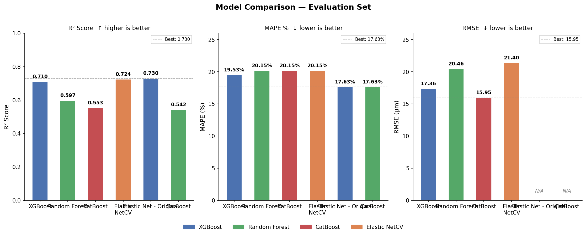
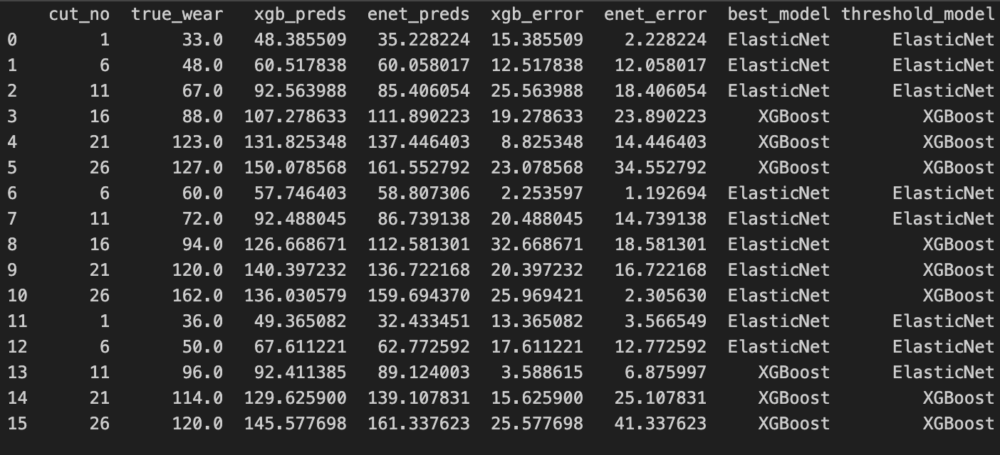

# PHM Challenge 2025 Solution

This repository contains the end-to-end machine learning pipeline for the **PHM Challenge 2025**. The solution focuses on robust feature engineering, advanced feature selection, and a cut-wise ensemble modeling strategy to predict tool wear.

## 🚀 Pipeline Overview

The pipeline integrates high-frequency sensor data and controller logs to extract meaningful features, followed by a multi-stage modeling approach.


## 🛠️ Feature Engineering

The feature extraction process is detailed in `feature_engineering.ipynb` and follows these four critical steps:

1.  **Step 1: Data Loading**: Read the sensor and controller data using a predefined `DataLoader`.
2.  **Step 2: Aggregation**: Generate aggregated features of sensor for different frequency ranges (Max, Min, Mean, Skew, Kurtosis).
3.  **Step 3: Frequency Analysis**: Utilising all the 8 bands for frequency wise feature extraction.
4.  **Step 4: Iterative Extraction**: Iterate through all the cuts in the `train_set` and `eval_set` to generate the features for training ML models.

### Extracted Features
For each signal/band, the following 8 statistical and signal-processing features are computed:
1.  **Maximum Value**
2.  **Minimum Value**
3.  **Skew**
4.  **Kurtosis**
5.  **Zero Crossings**
6.  **Standard Deviation**
7.  **Energy** (Sum of squares of the value)
8.  **Entropy** (|val| / signal.sum)

Processed features are stored in the `features/` directory, which contains features extracted from `feature_engineering.ipynb`.

## 🔍 Feature Selection

To refine the feature space and reduce dimensionality, **Mutual Information Regression** was employed. This method captures both linear and non-linear dependencies between features and the target tool wear. Further feature selection was done using this technique to identify the most robust predictors across different sets.

## 🤖 Modeling Strategy

Post-feature selection, the refined feature set was utilized to train multiple architectures, including **XGBoost**, **Random Forest**, **CatBoost**, and **Elastic Net**. Detailed training logs and model definitions can be found in `model_2.ipynb`.



### Cut-wise Ensemble Modeling
A specialized ensemble strategy was implemented based on the tool's lifecycle (cuts):
*   **Elastic Net**: Generally worked best for early-stage wear (below **Cut 11**).
*   **XGBoost**: Demonstrated superior performance for later stages (post **Cut 11**).



## 📂 Repository Structure

- `main.py`: Main entry point for the inference pipeline.
- `feature_engineering.ipynb`: Logic for feature extraction and preprocessing.
- `model_2.ipynb`: Contains the models trained and training logic.
- `features/`: Contains the features extracted from `feature_engineering.ipynb`.
- `lib/`: Core library code for data loading and feature utilities.
- `model/`: Directory for saved model weights and configurations.
- `tcdata/`: Dataset directory.
- `work/`: Output directory for results (e.g., `result.csv`).
- `Dockerfile` & `run.sh`: Environment setup and execution scripts for containerization.

## ⚙️ Requirements

To install the necessary dependencies:

```bash
pip install -r requirements.txt
```

## 🏃 Running the Pipeline

To execute the solution:

```bash
./run.sh
```
